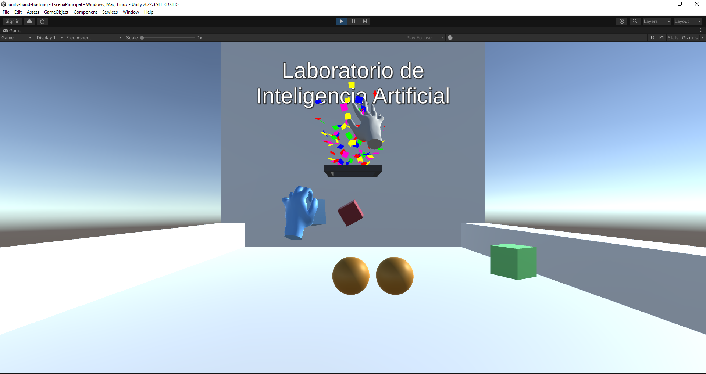

# Hand Tracking Game
Juego en Unity que recibe la informacion de los puntos de la mano del python-hand-gesture-recognition y la transforma en una mano tridimensional.
Se puede agarrar y soltar objetos haciendo gestos de puño y palma respectivamente. Con el gesto Victory, se resetea la posicion de los objetos.
Requiere al programa python-hand-gesture-recognition ejecutandose de fondo

## Escenarios demo:
- BasicHands: Es un escenario simple que se puede usar como punto de partida para crear proyectos
- Basketball: Es un juego en el que hay esferas y cubos que se pueden agarrar para lanzar y encestar en el aro.
- Cats: Es un minijuego en el que hay un conjunto de gatos que maullaran si se los acaricia.
- Piano: Es un juego en el que hay un piano que reproduce la nota correspondiente segun la tecla que se toca.
- Tic Tac Toe: es un juego multiplayer en el que por turnos, cada jugador puede tocar una casilla para que se marque con su simbolo y si se logra formar tres en raya, el jugador es el ganador.

## Organizacion del proyecto
- Carpetas XR, XRI: son las carpetas de las librerias de Realidad virtual reutilizadas para simular la mano y sus gestos.  
- Carpeta Samples: Contiene ejemplos de algunas de las librerias utilizadas  
- Carpeta TextMesh Pro: Libreria para insertar texto en el juego  
- Carpeta Materials: Colores utilizados en los escenarios  
- Carpeta PythonData: contiene el codigo para obtener los datos de la mano enviados a traves del socket de python-hand-gesture-recognition y distribuirlos a los Managers correspondientes.
- Carpeta Scenes: Contiene los escenarios de los diferentes juegos y ejemplos creados. Cada escenario tiene su propia carpeta donde estan los archivos utilizados su creacion.
- 

## PlayerHand Prefab
Contiene todo lo necesario para crear un par de manos que puedan moverse e interactuar, incluyendo:
- Manager: Gestiona los datos recibidos de posicion y gestos y envia los datos de la posicion al Manager del Minihand y controla la accion a realizar cuando se detecta un gesto.
- Mini Hand: contiene el MiniHand de la mano derecha e izquierda. Cada minihand esta compuesto de un conjunto de esferas que representan los puntos de la mano. Ademas contiene cilindros para mostrar las uniones entre los puntos de la mano. Los datos recibidos de la posicion de los puntos son recibidos del Manager y son puestos en los puntos para una previsualizacion prematura de los datos en un entorno tridimensional. Tambien controla los gestos de cada mano y lo que se hace en caso detecte alguno.
- XR Origin Hand: Es un objeto de la libreria XR Hands que contiene un entorno en el que se encuentra el modelo de la mano, junto con las demas dependencias para que la mano pueda realizar interacciones. Los principales elementos dentro son:
    - Left/Right Hand: Contiene todo lo necesario para mostrar una mano
        - Direct Interactor: Tiene el objeto que habilita la posibilidad de interactuar. Se puede configurar la forma en la que interactua, incluyendo la posicion del interactuador, prioridad, eventos, etc.
        - Left/Right Hand Interaction Visual: Controla la visualizacion de la mano.
            - L/R Wrist: Es el punto en el que esta la muñeca de la mano, ademas, adentro de este objeto estan incluidos los demas puntos de la mano.
            - Left/Right Hand: Es el modelo de la mano que se renderiza.
    - Hand Visualizer: Contiene mas configuraciones para la renderizacion de la mano.

## Multiplayer
Para poder realizar el multiplayer del proyecto, se utilizaron las librerias de NetCode for GameObjects y Multiplayer Tools. Para manejar la conexion general se necesita un colocar NetworkManager en el juego. Luego, los objetos que deban reportarse al servidor, deben incluir el componente Network Object. Ademas, para poder compartir la informacion de la posicion de un objeto, se le debe incluir el componente Client Network Transform. La interfaz de los juegos permite presionar Host para que un usuario tome el rol de host, lo cual mostrara su IP en pantalla. Los demas usuarios que se quieran conectar, deberan ingresar la IP del host y luego presionar Client.

## Creacion de proyectos
Para una facil creacion de proyectos, se puede utilizar el escenario BaseHands para tener un punto de partida ya configurado. Se tiene solo una superficie y un cubo interactuable con las manos que apareceran luego conectarse al servidor. Para personalizar el juego, se pueden incluir nuevos objetos como cubos o modelos. Para que sean interactuables, se les debe agregar el componente XR Simple Interactable para que permita la interaccion, o XR Grab Interactable para que permita agarrar el objeto. Ademas, al ejecutar la escena, si se desea que no sea utilizar multiplayer, simplemente hacer click en Host para que aparezcan las manos y luego Hide para esconder la interfaz.